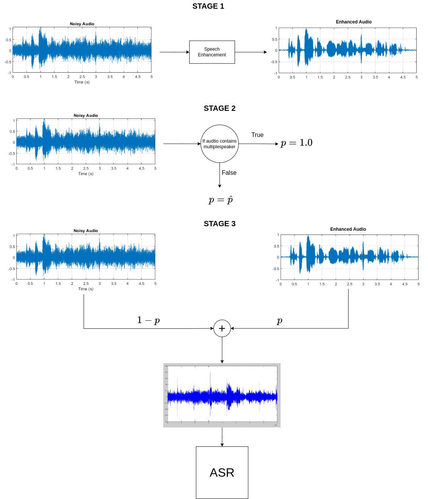
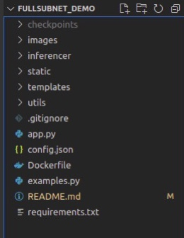
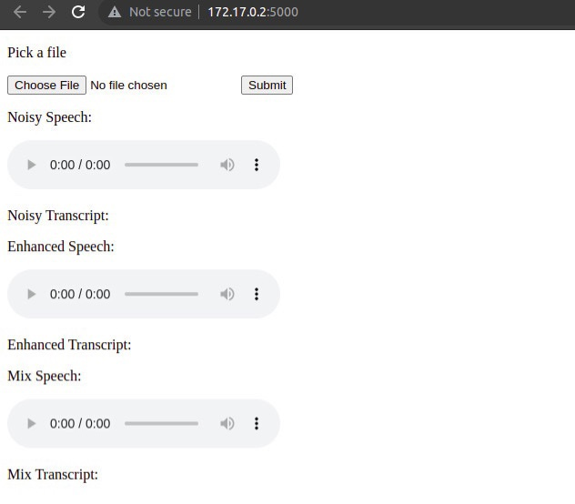

# SPEECH ENHANCEMENT FOR ASR USAGE
## Table of contents
1. [Description](#description)  
2. [Usage](#usage)  
3. [Web App](#webapp) 
4. [API Calls](#apicalls) 


<a name="description"></a>
## Description

This is a demo for FullSubNet Speech Enhancement for Vietnamese ASR. The Speech Enhancement model was trained on 1k3 hours of speech data with dynamic mixing (mix-on-the-fly). </br>
Here, we found an approach to remedy the problem of SE when adapting as front-end to ASR, which causes the degradation of ASR decoding performance on clean speech. The idea is simple but can work with any SE and ASR models. 



<a name="usage"></a>
## Usage
### Download checkpoints

1. First, download the model checkpoints from this [link](https://drive.google.com/drive/folders/1ELE8qiGuIrTbU6Kj6Ljhv4v7WZho-CCJ?usp=sharing)
2. Move the downloaded folder to the root directory and rename it as "checkpoints" 
3. Set up environment with either Docker or Manually

### Docker

Docker build
```
docker build -t demo .
```
Docker run
```
Docker run demo
```

### Manually
Install packages
```
pip install -r requirements.txt
```
Run Flask app
```
python app.py -c config.json
```


<a name="webapp"></a>
## Web App



<a name="apicalls"></a>
## API Calls

Check [example.py](examples.py) file for API usage
